# SARS-CoV-2 infection of human choroid plexus organoids: SARS-CoV-2 72 hpi vs Mock 72 hpi (GSE157852)

## 1. Executive Summary
This analysis compared SARS-CoV-2-infected and mock-infected hiPSC-derived choroid plexus organoids using the authors' raw integer counts from GEO (GSE157852). 3,212 of 15,308 tested genes were differentially expressed. Viral transcripts were strongly detected in infected samples. The host response was up-regulation of migration, extracellular matrix, focal adhesion and cytokine/chemokine genes, and down-regulation of ion-transport and secretory genes. The design has few replicates per group, so the results should be read with that in mind.

## 2. Experimental Design
- Dataset: GSE157852, authors' supplementary file (GSE157852_CPO_RawCounts.txt.gz); data source: GEO count matrix.
- Model system: hiPSC-derived choroid plexus organoids (CPOs), Homo sapiens. The associated study is (Jacob et al., 2020; PMID: 33010822).
- Conditions: Mock 72 hpi, SARS-CoV-2 72 hpi, with 3 Mock and 3 SARS-CoV-2 replicates (6 samples in total).
- The contrast was SARS-CoV-2 72 hpi vs Mock 72 hpi, with Mock as the reference. The GEO series also contains earlier-time-point infected samples, which are not in the supplied matrix and were not analysed.

## 3. Quality Control

| Sample | Condition | Total counts | Genes detected |
|---|---|---|---|
| Mock_72_hpi_rep1 | Mock 72 hpi | 23,507,394 | 20,894 |
| Mock_72_hpi_rep2 | Mock 72 hpi | 22,884,961 | 20,393 |
| Mock_72_hpi_rep3 | Mock 72 hpi | 20,121,047 | 19,643 |
| SARS_CoV_2_72_hpi_rep1 | SARS-CoV-2 72 hpi | 31,305,936 | 21,330 |
| SARS_CoV_2_72_hpi_rep2 | SARS-CoV-2 72 hpi | 16,889,301 | 20,072 |
| SARS_CoV_2_72_hpi_rep3 | SARS-CoV-2 72 hpi | 23,628,250 | 19,946 |

*Genes detected: genes with at least one count, before low-count filtering.*

Library sizes ranged from 16.9 to 31.3 million reads (median 23.2 million). Detected genes per sample ranged from 19,643 to 21,330.

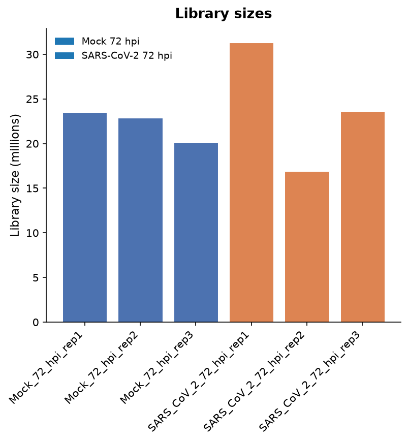

*File: `figures/library_sizes.png` — Total counts per sample before low-count filtering (6 samples, 16.9–31.3 million), coloured by condition.*

PC1 and PC2 explain 44.5% and 31.2% of variance. On PC1–PC2, mean distance of replicates to their group centroid: Mock 72 hpi 20.4, SARS-CoV-2 72 hpi 45.8; group centroids are 87.5 apart. The most spread group is 2.2× the least spread. Condition explains 89% of PC1 and 8% of PC2 variance. Samples closer to another group's centroid: none. The infected group is therefore noticeably more spread than the mock group.

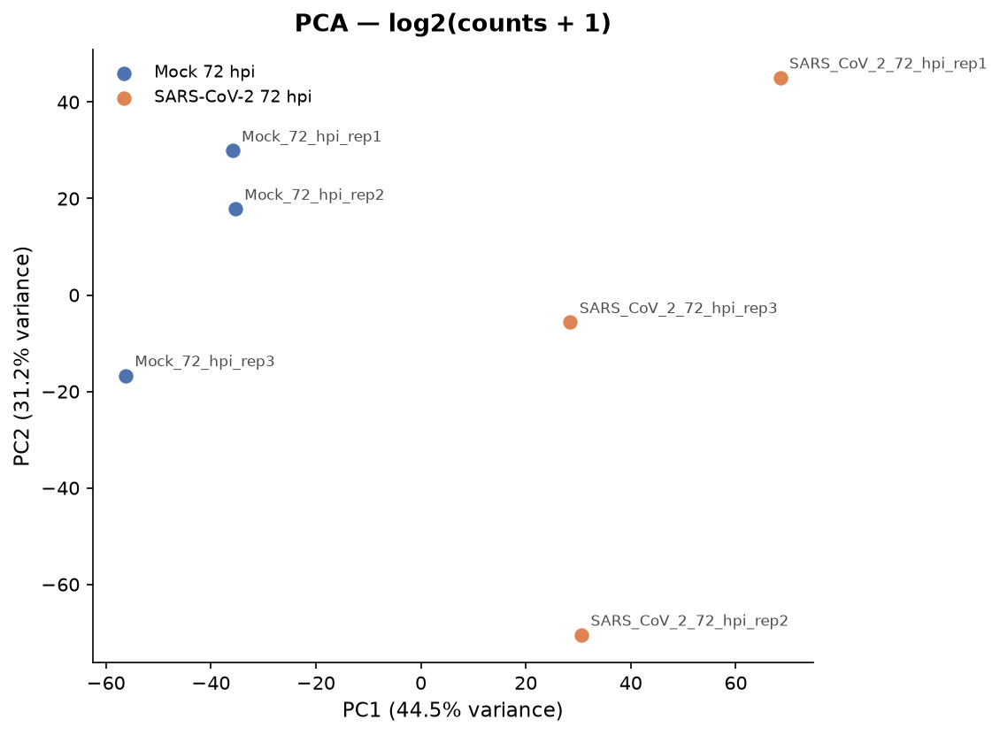

*File: `figures/pca.png` — PCA of log2(counts + 1): PC1 44.5%, PC2 31.2% of variance, coloured by condition. On PC1–PC2, mean distance of replicates to their group centroid: Mock 72 hpi 20.4, SARS-CoV-2 72 hpi 45.8; group centroids are 87.5 apart. The most spread group is 2.2× the least spread. Condition explains 89% of PC1 and 8% of PC2 variance. Samples closer to another group's centroid: none.*

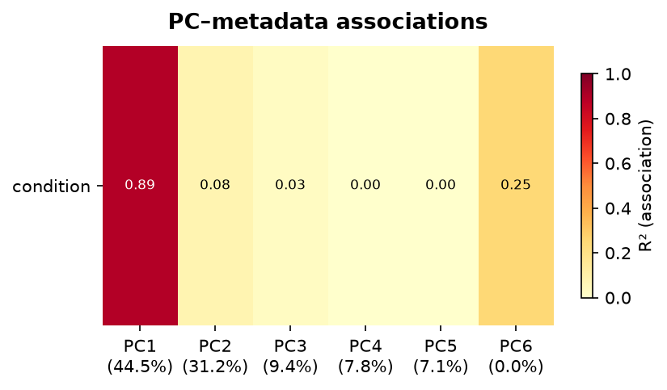

*File: `figures/pc_association.png` — Association (R²) between the first 6 principal components and design variables: condition.*

Pairwise sample correlations ranged from 0.95 to 0.99.

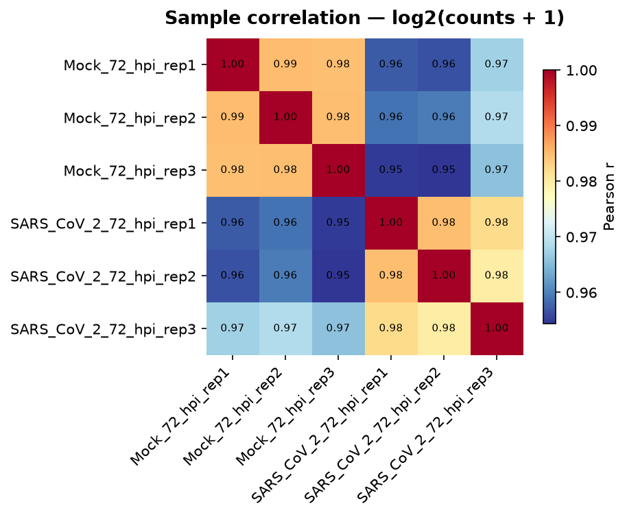

*File: `figures/sample_correlation.png` — Pearson correlation of log2(counts + 1) between all 6 samples (range 0.95–0.99 between different samples).*

No sample was flagged as misclustered (none), and no sample was removed.

## 4. Differential Expression

| Measure | Value |
|---|---|
| Contrast | SARS-CoV-2 72 hpi vs Mock 72 hpi |
| Design | `~condition` |
| Genes tested | 15,308 |
| Significant (padj < 0.05) | 3,212 (21.0%) |
| Up-regulated | 1,688 (11.0%) |
| Down-regulated | 1,524 (10.0%) |

The volcano and MA plots show 11.0% of tested genes up and 10.0% down at the significance threshold.

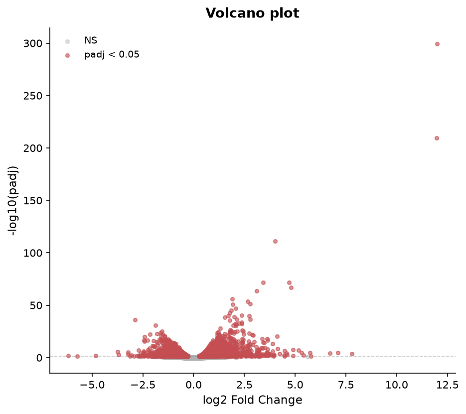

*File: `figures/volcano.png` — Volcano plot: 15308 genes tested; 3212 with padj < 0.05 (1688 up, 1524 down; design ~condition).*

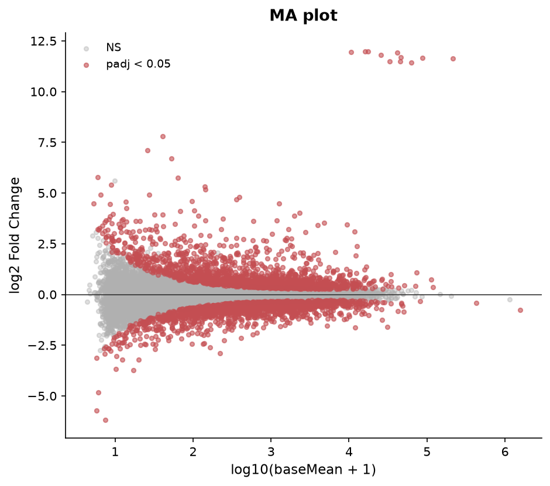

*File: `figures/ma_plot.png` — MA plot: 15308 genes tested; 3212 with padj < 0.05 (1688 up, 1524 down; design ~condition).*

### Top up-regulated genes

| Gene | log2FC | padj | baseMean |
|---|---|---|---|
| ORF6 | 11.97 | < 1e-300 | 17457 |
| ORF3a | 11.92 | < 1e-300 | 41857 |
| ORF10 | 11.79 | < 1e-300 | 25478 |
| ORF8 | 11.68 | < 1e-300 | 46487 |
| S | 11.67 | < 1e-300 | 87812 |
| N | 11.64 | < 1e-300 | 214791 |
| ORF1ab/ORF1a | 11.50 | < 1e-300 | 33421 |
| ORF7a | 11.48 | < 1e-300 | 45383 |
| M | 11.43 | < 1e-300 | 62692 |
| E | 11.98 | 4.01e-300 | 16198 |

The top of the list is dominated by SARS-CoV-2 genomic and subgenomic transcripts, for example N (log2FC 11.64, padj < 1e-300), S (log2FC 11.67, padj < 1e-300) and ORF3a (log2FC 11.92, padj < 1e-300). These reflect viral reads in infected samples, since the Mock samples have essentially none. Among host genes, TM4SF1 (log2FC 4.01, padj 6.17e-112), CTGF (log2FC 3.43, padj 2.78e-72) and CCL2 (log2FC 3.52, padj 5.98e-10) are strongly up.

### Top down-regulated genes

| Gene | log2FC | padj | baseMean |
|---|---|---|---|
| UGT2A1 | -2.88 | 1.05e-36 | 222 |
| NWD1 | -1.88 | 1.22e-31 | 656 |
| KDR | -1.56 | 1.17e-25 | 597 |
| SNTG1 | -1.64 | 2.79e-24 | 794 |
| CACNA2D3 | -1.81 | 1.21e-23 | 251 |
| WFIKKN2 | -2.15 | 3.40e-23 | 410 |
| SOSTDC1 | -1.54 | 5.30e-23 | 5260 |
| SLC17A8 | -1.61 | 3.98e-22 | 12023 |
| OPCML | -1.45 | 1.86e-21 | 636 |
| GPC6 | -1.41 | 8.71e-21 | 850 |

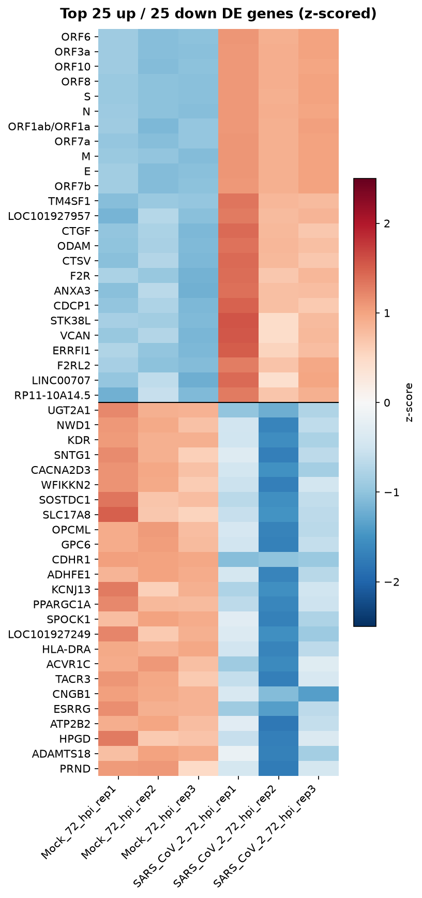

*File: `figures/de_heatmap.png` — Top 25 up-regulated (above the line) and 25 down-regulated genes with padj < 0.05, ranked by padj then |log2FC|; z-scored log2(counts + 1) across 6 samples.*

Other results of interest:
- The choroid plexus marker TTR (log2FC -0.76, padj 4.21e-08) is modestly decreased.
- ACE2 (log2FC -0.87, padj 0.067) and TMPRSS2 (log2FC -0.11, padj 0.934) are not significantly changed.
- IFIT1 (log2FC -1.39, padj 4.04e-16) is down, so there is no sign of a canonical interferon-stimulated gene induction. It was the only interferon-stimulated gene I queried that passed filtering.
- CLDN* genes: 8 of 13 significant (2 up, 6 down) claudins are mixed: CLDN5 (log2FC -1.62, padj 7.95e-04), CLDN2 (log2FC -1.40, padj 8.93e-07) and CLDN16 (log2FC -1.11, padj 1.93e-04) are down, while CLDN4 (log2FC 1.68, padj 0.018) and CLDN6 (log2FC 2.59, padj 0.001) are up.

## 5. Gene Set Enrichment
### Up-regulated genes

| Library | Term | Overlap | padj |
|---|---|---|---|
| GO Biological Process 2023 | Regulation Of Cell Migration (GO:0030334) | 39/434 | 1.23e-08 |
| GO Biological Process 2023 | Positive Regulation Of Cell Migration (GO:0030335) | 29/272 | 6.19e-08 |
| GO Biological Process 2023 | Positive Regulation Of Cell Motility (GO:2000147) | 25/221 | 2.56e-07 |
| GO Biological Process 2023 | Regulation Of Wound Healing (GO:0061041) | 12/47 | 7.04e-07 |
| GO Biological Process 2023 | Regulation Of Cell Population Proliferation (GO:0042127) | 47/766 | 6.64e-06 |
| GO Biological Process 2023 | Extracellular Matrix Organization (GO:0030198) | 20/176 | 6.64e-06 |
| GO Biological Process 2023 | Regulation Of Blood Coagulation (GO:0030193) | 9/29 | 6.64e-06 |
| GO Biological Process 2023 | Integrin-Mediated Signaling Pathway (GO:0007229) | 14/85 | 6.64e-06 |
| GO Biological Process 2023 | Regulation Of Apoptotic Process (GO:0042981) | 42/705 | 5.05e-05 |
| GO Biological Process 2023 | Positive Regulation Of Peptidyl-Tyrosine Phosphorylation (GO:0050731) | 15/130 | 2.09e-04 |
| KEGG 2021 Human | Focal adhesion | 28/201 | 3.77e-11 |
| KEGG 2021 Human | ECM-receptor interaction | 15/88 | 5.01e-07 |
| KEGG 2021 Human | Complement and coagulation cascades | 14/85 | 1.73e-06 |
| KEGG 2021 Human | Regulation of actin cytoskeleton | 21/218 | 8.14e-06 |
| KEGG 2021 Human | AGE-RAGE signaling pathway in diabetic complications | 14/100 | 8.57e-06 |
| KEGG 2021 Human | Small cell lung cancer | 12/92 | 1.10e-04 |
| KEGG 2021 Human | PI3K-Akt signaling pathway | 25/354 | 1.10e-04 |
| KEGG 2021 Human | Proteoglycans in cancer | 18/205 | 1.19e-04 |
| KEGG 2021 Human | Tight junction | 15/169 | 5.82e-04 |
| KEGG 2021 Human | Amoebiasis | 11/102 | 0.001 |

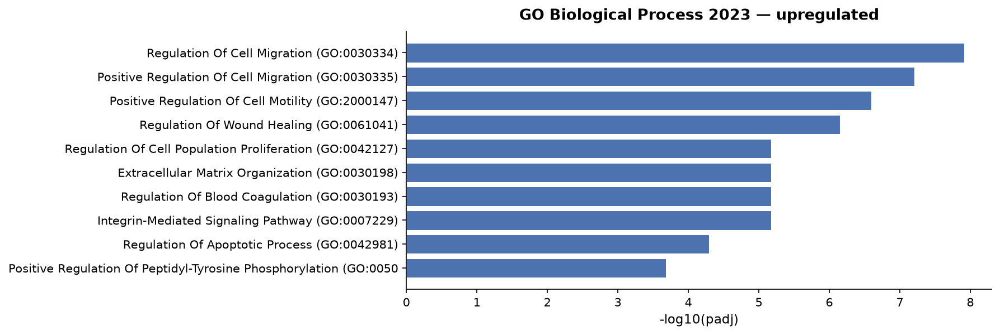

*File: `figures/enrichment_upregulated_go_biological_process_2023.png` — Enrichr GO_Biological_Process_2023, upregulated genes (500 input genes): top 10 terms by adjusted p-value.*

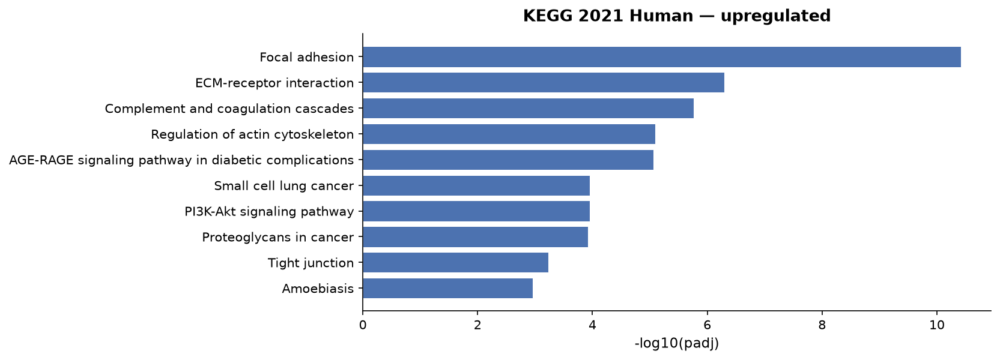

*File: `figures/enrichment_upregulated_kegg_2021_human.png` — Enrichr KEGG_2021_Human, upregulated genes (500 input genes): top 10 terms by adjusted p-value.*

### Down-regulated genes

| Library | Term | Overlap | padj |
|---|---|---|---|
| GO Biological Process 2023 | Metal Ion Transport (GO:0030001) | 15/171 | 0.002 |
| GO Biological Process 2023 | Inorganic Cation Import Across Plasma Membrane (GO:0098659) | 9/103 | 0.088 |
| GO Biological Process 2023 | Calcium Ion Transmembrane Import Into Cytosol (GO:0097553) | 8/83 | 0.088 |
| GO Biological Process 2023 | Monoatomic Ion Transport (GO:0006811) | 9/107 | 0.088 |
| GO Biological Process 2023 | Sodium Ion Transport (GO:0006814) | 8/89 | 0.088 |
| GO Biological Process 2023 | Monoatomic Cation Transmembrane Transport (GO:0098655) | 15/281 | 0.088 |
| GO Biological Process 2023 | Calcium-Independent Cell-Cell Adhesion Via Plasma Membrane Cell-Adhesion Molecules (GO:0016338) | 4/19 | 0.088 |
| GO Biological Process 2023 | Inorganic Cation Transmembrane Transport (GO:0098662) | 15/284 | 0.088 |
| GO Biological Process 2023 | Potassium Ion Transport (GO:0006813) | 9/122 | 0.094 |
| GO Biological Process 2023 | Calcium Ion Import Across Plasma Membrane (GO:0098703) | 5/37 | 0.094 |
| KEGG 2021 Human | Bile secretion | 9/90 | 0.013 |
| KEGG 2021 Human | Pancreatic secretion | 9/102 | 0.017 |
| KEGG 2021 Human | Proximal tubule bicarbonate reclamation | 4/23 | 0.056 |
| KEGG 2021 Human | Mineral absorption | 6/60 | 0.056 |
| KEGG 2021 Human | Aldosterone synthesis and secretion | 7/98 | 0.125 |
| KEGG 2021 Human | Adrenergic signaling in cardiomyocytes | 8/150 | 0.289 |
| KEGG 2021 Human | Oxytocin signaling pathway | 8/154 | 0.289 |
| KEGG 2021 Human | Adipocytokine signaling pathway | 5/69 | 0.289 |
| KEGG 2021 Human | PPAR signaling pathway | 5/74 | 0.313 |
| KEGG 2021 Human | Gastric acid secretion | 5/76 | 0.313 |

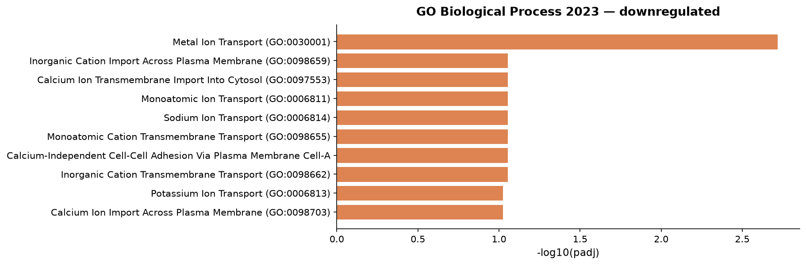

*File: `figures/enrichment_downregulated_go_biological_process_2023.png` — Enrichr GO_Biological_Process_2023, downregulated genes (384 input genes): top 10 terms by adjusted p-value.*

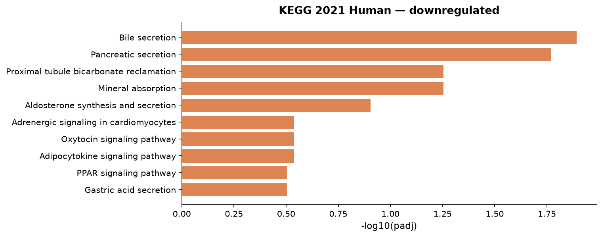

*File: `figures/enrichment_downregulated_kegg_2021_human.png` — Enrichr KEGG_2021_Human, downregulated genes (384 input genes): top 10 terms by adjusted p-value.*

The up-regulated set is enriched for cell migration, wound healing, extracellular matrix and adhesion terms, for example Regulation Of Cell Migration (GO:0030334) (39/434 genes, padj 1.23e-08), Extracellular Matrix Organization (GO:0030198) (20/176 genes, padj 6.64e-06) and Focal adhesion (28/201 genes, padj 3.77e-11). The apoptosis term Regulation Of Apoptotic Process (GO:0042981) (42/705 genes, padj 5.05e-05) is also enriched. Among the down-regulated genes, Metal Ion Transport (GO:0030001) (15/171 genes, padj 0.002) and Bile secretion (9/90 genes, padj 0.013) are the terms that pass the significance threshold. Most other down-regulated terms do not reach it.

## 6. Comparison with the published study
The abstract of (Jacob et al., 2020; PMID: 33010822) names no specific genes, so no paper-gene table is shown. The abstract reports increased cell death and transcriptional dysregulation indicative of an inflammatory response and cellular function deficits after infection. Here the apoptosis-related term Regulation Of Apoptotic Process (GO:0042981) (42/705 genes, padj 5.05e-05) and the inflammatory term Inflammatory Response (GO:0006954) (15/236 genes, padj 0.023) are enriched among up-regulated genes, which is compatible with that description. The inflammatory term is only modestly significant. The down-regulation of ion transport and secretory genes could correspond to the reported function deficits, but the abstract does not say so.

## 7. Biological Interpretation
- Infection is clearly present, with very large increases in viral transcripts such as N (log2FC 11.64, padj < 1e-300) and ORF8 (log2FC 11.68, padj < 1e-300).
- The host response is dominated by extracellular matrix, adhesion and migration programmes (ECM-receptor interaction (15/88 genes, padj 5.01e-07)). The chemokine CCL2 (log2FC 3.52, padj 5.98e-10) and the adhesion molecule ICAM1 (log2FC 1.35, padj 1.41e-06) are also up.
- Apoptosis-related genes go up, for example CASP8 (log2FC 1.49, padj 4.56e-09). This is consistent with the cell death described in (Jacob et al., 2020; PMID: 33010822).
- Down-regulated genes point to loss of transport and secretory functions (Bile secretion (9/90 genes, padj 0.013)). AQP1 (log2FC -1.22, padj 0.004), ATP1A2 (log2FC -1.42, padj 7.53e-09) and SLC4A4 (log2FC -1.03, padj 6.10e-05) are all down.
- An interferon response is not evident: IFIT1 (log2FC -1.39, padj 4.04e-16) falls, and the interferon-related terms searched were not significantly enriched (Response To Type II Interferon (GO:0034341) (4/80 genes, padj 0.392)).

## 8. Limitations
- There are only 3 replicates per group, and the infected group is more spread in PCA than the mock group (45.8 versus 20.4).
- The data are bulk RNA-seq of whole organoids, so changes in cell composition (for example cell loss) cannot be separated from changes in expression within cells.
- Enrichment used Enrichr over-representation. The up-regulated list was capped at the maximum number of genes, so 576 genes passed the thresholds but 500 were used.
- Several down-regulated terms have padj above the significance threshold, so they are suggestive only.
- Viral genes appear in the count matrix and were included in the DE analysis and the top-gene lists.
- Only the single contrast requested was performed. Other time points in the GEO series were not analysed.

## 9. Methods

### Data

Counts: authors' supplementary file `GSE157852_CPO_RawCounts.txt.gz` from GEO GSE157852 (MD5 `988011dda6a9b9c5c2830a862aaeba94`); values: raw integer counts; gene IDs: symbol; 0 duplicate gene IDs summed.

### Quality control

Library size is the total count per sample and genes detected the number of genes with at least one count, both computed before low-count filtering. PCA: singular value decomposition of gene-centred log2(counts + 1) of the filtered matrix (15,308 genes), without scaling. Sample correlation: Pearson correlation of log2(counts + 1) of the filtered matrix (15,308 genes).

### Low-count filtering

Genes were kept when at least 2 samples had ≥ 10 counts: 15,308 of 29,755 genes kept (48.6% removed).

### Differential expression

Differential expression was tested with PyDESeq2 0.5.4 using the design `~condition`, comparing SARS-CoV-2 72 hpi with Mock 72 hpi (reference level). PyDESeq2 fits a negative binomial generalised linear model per gene, with median-of-ratios size factors and dispersions shrunk towards a fitted trend, and tests the condition coefficient with a Wald test. P-values were adjusted with the Benjamini–Hochberg method after PyDESeq2's default independent filtering and Cook's-distance outlier handling; 15,308 genes received an adjusted p-value. Genes with padj < 0.05 are called significant. Log2 fold changes are unshrunken maximum-likelihood estimates.

### Enrichment (up-regulated)

Over-representation analysis of up-regulated genes used Enrichr through GSEApy 1.3.1 against GO_Biological_Process_2023, KEGG_2021_Human (human). Genes with padj < 0.05 and |log2FC| ≥ 1.0 (576 genes) were ranked by padj, then |log2FC|, and the top 500 submitted as 500 gene symbols. Enrichr's default background (all genes in each library) was used, not the genes tested here. Terms are reported by Enrichr's adjusted p-value (Benjamini–Hochberg). Exact input: `analysis/enrichment_input_upregulated.txt`.

### Enrichment (down-regulated)

Over-representation analysis of down-regulated genes used Enrichr through GSEApy 1.3.1 against GO_Biological_Process_2023, KEGG_2021_Human (human). Genes with padj < 0.05 and |log2FC| ≥ 1.0 (384 genes) were ranked by padj, then |log2FC|, and the top 384 submitted as 384 gene symbols. Enrichr's default background (all genes in each library) was used, not the genes tested here. Terms are reported by Enrichr's adjusted p-value (Benjamini–Hochberg). Exact input: `analysis/enrichment_input_downregulated.txt`.

### Software

| Software | Version |
|---|---|
| Python | 3.11.14 |
| NumPy | 2.4.6 |
| pandas | 2.3.3 |
| PyDESeq2 | 0.5.4 |
| Matplotlib | 3.11.2 |
| SciPy | 1.17.1 |
| GSEApy | 1.3.1 |

### Reproducibility

Every analysis step is logged in `analysis/tool_calls.jsonl`, and `analysis/replay.py` re-runs them without the LLM. This Methods section is generated from those steps, not written by the LLM.

## 10. References
(Jacob et al., 2020; PMID: 33010822)

---

**Disclaimer:** This report was generated by an AI system. Large language models can produce inaccurate statements (hallucinations). All biological claims, gene annotations, pathway interpretations, and cited references should be independently verified before use in publications or clinical decisions. Biological roles listed alongside gene names are AI-generated summaries and must be verified against primary databases (UniProt, NCBI Gene).
