## 1. Executive Summary

Raw gene counts from GSE164073 (authors' supplementary file, file GSE164073_Eye_count_matrix.csv.gz) were analysed to compare SARS-CoV-2-infected human ocular surface tissue against mock-infected controls. Using a design that adjusts for tissue of origin (~tissue + condition), differential expression identified 2,491 genes changed (padj < 0.05: 1,147 up, 1,344 down out of 14,937 tested). Upregulated genes are strongly enriched for inflammatory/NF-κB and chemokine signalling (Inflammatory Response (GO:0006954) (14/236 genes, padj 3.35e-12), NF-kappa B signaling pathway (9/104 genes, padj 2.67e-10)), consistent with the associated study's report of an NF-κB-driven response to infection ((Eriksen et al., 2021; PMID: 34022129)), while downregulated genes are enriched for epithelial differentiation programs (Epithelium Development (GO:0060429) (11/154 genes, padj 1.40e-05)).

## 2. Experimental Design

This dataset profiles the transcriptional response of human ocular surface tissue (cornea, limbus, sclera; donor cadaver explants) to SARS-CoV-2 infection versus mock treatment, as described in (Eriksen et al., 2021; PMID: 34022129). The loaded design covers 18 samples across the conditions mock, SARS-CoV-2, MOI = 1.0 (9 mock, 9 infected), with tissue levels cornea, limbus, sclera and a time point of 24 hours. Because tissue is a major source of variation shared across both conditions (three tissues × two conditions × triplicate donors), tissue was included as a covariate in the DESeq2 model (design ~tissue + condition) so that the SARS-CoV-2-vs-mock contrast is estimated within each tissue and pooled across tissues.

## 3. Quality Control

| Sample | Condition | Total counts | Genes detected |
|---|---|---|---|
| Cornea_mock_1 | mock | 21,671,080 | 17,279 |
| Cornea_mock_2 | mock | 24,159,485 | 17,402 |
| Cornea_mock_3 | mock | 22,250,196 | 17,501 |
| Cornea_CoV2_1 | SARS-CoV-2, MOI = 1.0 | 21,132,364 | 17,382 |
| Cornea_CoV2_2 | SARS-CoV-2, MOI = 1.0 | 23,108,608 | 17,530 |
| Cornea_CoV2_3 | SARS-CoV-2, MOI = 1.0 | 19,747,453 | 17,204 |
| Limbus_mock_1 | mock | 27,437,746 | 17,636 |
| Limbus_mock_2 | mock | 24,784,480 | 17,546 |
| Limbus_mock_3 | mock | 24,217,276 | 17,606 |
| Limbus_CoV2_1 | SARS-CoV-2, MOI = 1.0 | 20,381,048 | 17,242 |
| Limbus_CoV2_2 | SARS-CoV-2, MOI = 1.0 | 19,300,234 | 17,217 |
| Limbus_CoV2_3 | SARS-CoV-2, MOI = 1.0 | 23,957,665 | 17,516 |
| Sclera_mock_1 | mock | 19,874,472 | 16,958 |
| Sclera_mock_2 | mock | 19,131,739 | 17,008 |
| Sclera_mock_3 | mock | 23,503,610 | 17,298 |
| Sclera_CoV2_1 | SARS-CoV-2, MOI = 1.0 | 20,732,156 | 17,006 |
| Sclera_CoV2_2 | SARS-CoV-2, MOI = 1.0 | 18,948,711 | 17,009 |
| Sclera_CoV2_3 | SARS-CoV-2, MOI = 1.0 | 26,121,136 | 17,474 |

*Genes detected: genes with at least one count, before low-count filtering.*

Library sizes ranged from 18.9 to 27.4 million reads (median 22.0 million), and the minimum number of genes detected in any sample was 16,958 (maximum 17,636). Pairwise sample correlations ranged from 0.88 to 0.99.

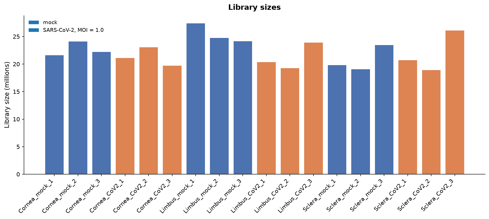

*File: `figures/library_sizes.png` — Total counts per sample before low-count filtering (18 samples, 18.9–27.4 million), coloured by condition.*

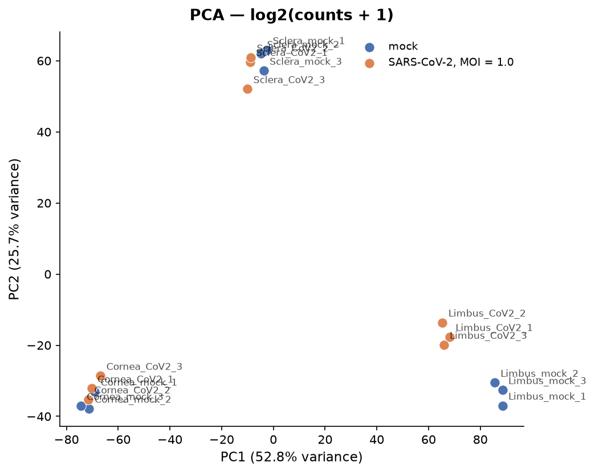

*File: `figures/pca.png` — PCA of log2(counts + 1): PC1 52.8%, PC2 25.7% of variance, coloured by condition. On PC1–PC2 within each tissue level (DESeq2 covariate), mean distance of replicates to their group centroid: SARS-CoV-2, MOI = 1.0 3.1, mock 2.8; group centroids are on average 12.5 apart. The most spread group is 1.1× the least spread. Condition explains 0% of PC1 and 0% of PC2 variance; tissue explains 99% and 98%. Samples closer to another group's centroid within each tissue level: Cornea_mock_1 (closer to SARS-CoV-2, MOI = 1.0), Cornea_CoV2_2 (closer to mock).*

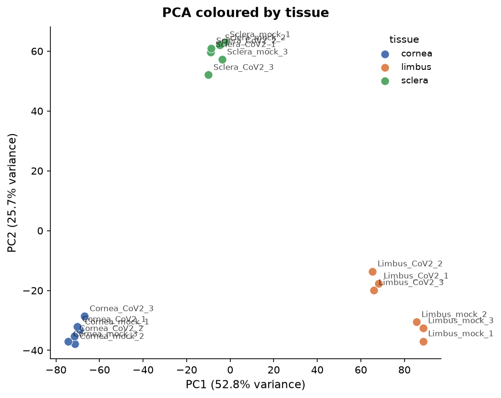

*File: `figures/pca_tissue.png` — PCA of log2(counts + 1) coloured by tissue (3 values).*

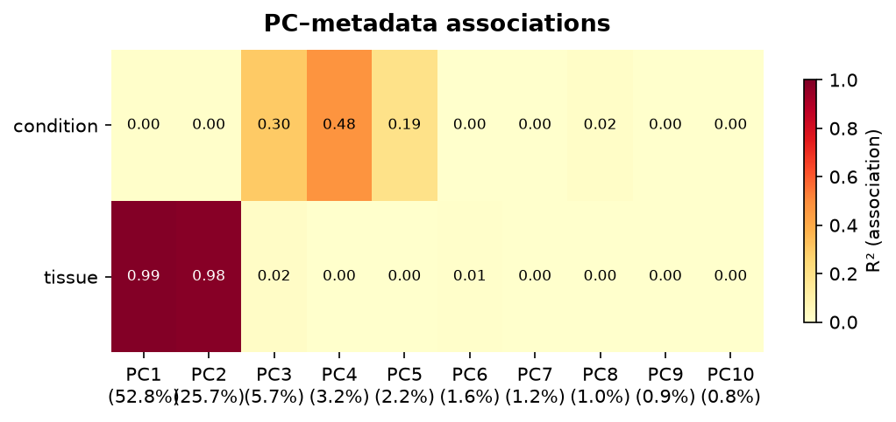

*File: `figures/pc_association.png` — Association (R²) between the first 10 principal components and design variables: condition, tissue.*

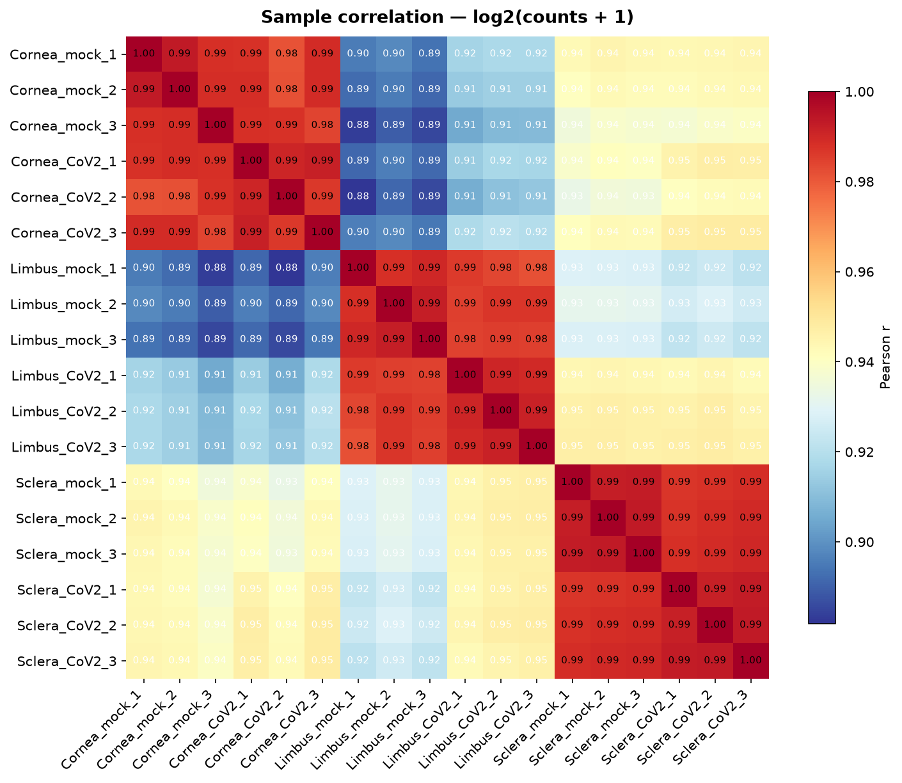

*File: `figures/sample_correlation.png` — Pearson correlation of log2(counts + 1) between all 18 samples (range 0.88–0.99 between different samples).*

On PC1–PC2 within each tissue level (DESeq2 covariate), mean distance of replicates to their group centroid: SARS-CoV-2, MOI = 1.0 3.1, mock 2.8; group centroids are on average 12.5 apart. The most spread group is 1.1× the least spread. Condition explains 0% of PC1 and 0% of PC2 variance; tissue explains 99% and 98%. Samples closer to another group's centroid within each tissue level: Cornea_mock_1 (closer to SARS-CoV-2, MOI = 1.0), Cornea_CoV2_2 (closer to mock). As the PCA plots show, PC1 and PC2 are dominated by tissue identity (99% and 98% of variance respectively) rather than infection status, which is why tissue was modelled as a covariate rather than left unadjusted. Within-tissue replicate spread is similar between the two conditions (3.1 vs 2.8), and only two samples (Cornea_mock_1, Cornea_CoV2_2) fall closer to the other condition's centroid within their tissue group. No samples were excluded as outliers.

## 4. Differential Expression

| Measure | Value |
|---|---|
| Contrast | SARS-CoV-2, MOI = 1.0 vs mock |
| Design | `~tissue + condition` |
| Genes tested | 14,937 |
| Significant (padj < 0.05) | 2,491 (16.7%) |
| Up-regulated | 1,147 (7.7%) |
| Down-regulated | 1,344 (9.0%) |

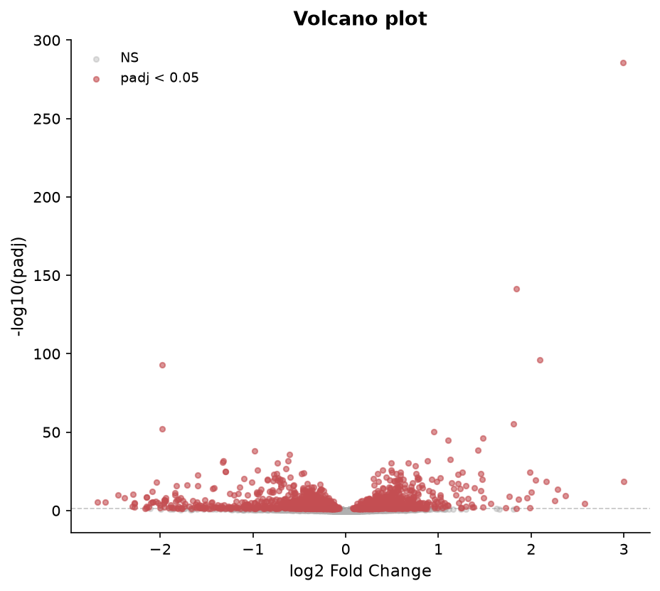

*File: `figures/volcano.png` — Volcano plot: 14937 genes tested; 2491 with padj < 0.05 (1147 up, 1344 down; design ~tissue + condition).*

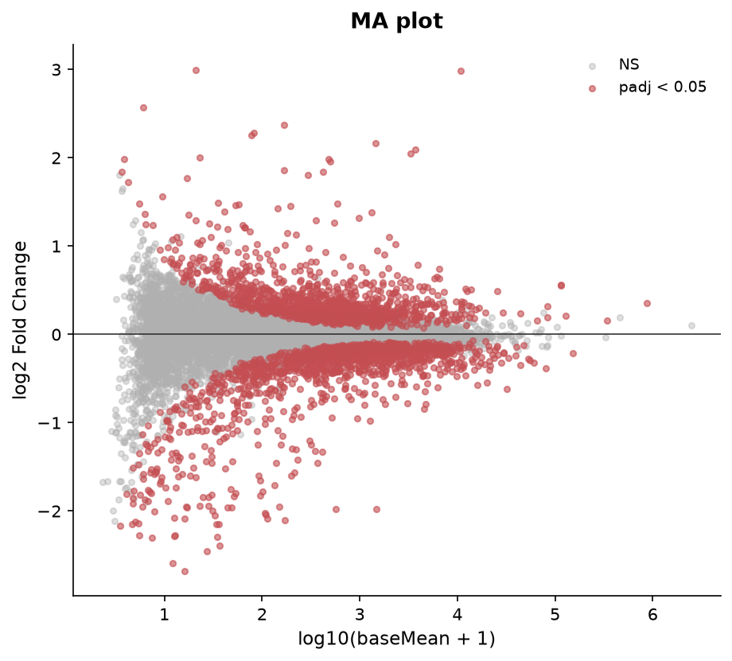

*File: `figures/ma_plot.png` — MA plot: 14937 genes tested; 2491 with padj < 0.05 (1147 up, 1344 down; design ~tissue + condition).*

Top upregulated genes include SOD2 (log2FC 2.99, padj 1.67e-286), TNFAIP3 (log2FC 1.84, padj 2.37e-142) and C3 (log2FC 2.09, padj 6.23e-97); top downregulated genes include ACAN (log2FC -1.98, padj 1.43e-93) and ACTC1 (log2FC -1.98, padj 1.04e-52).

| Gene | log2FC | padj | baseMean |
|---|---|---|---|
| SOD2 | 2.99 | 1.67e-286 | 10827 |
| TNFAIP3 | 1.84 | 2.37e-142 | 422 |
| C3 | 2.09 | 6.23e-97 | 3694 |
| RIPOR3 | 1.81 | 9.14e-56 | 296 |
| CA12 | 0.95 | 4.67e-51 | 1515 |
| TNFAIP2 | 1.48 | 8.83e-47 | 593 |
| PTGFR | 1.11 | 1.39e-45 | 2000 |
| RELB | 1.43 | 2.73e-39 | 145 |
| ZC3H12A | 1.13 | 4.34e-33 | 222 |
| NFKBIZ | 0.88 | 1.58e-32 | 669 |

| Gene | log2FC | padj | baseMean |
|---|---|---|---|
| ACAN | -1.98 | 1.43e-93 | 1472 |
| ACTC1 | -1.98 | 1.04e-52 | 563 |
| LBH | -0.98 | 1.27e-38 | 1273 |
| BDNF | -0.61 | 1.83e-36 | 705 |
| CTGF | -0.62 | 2.69e-32 | 32025 |
| SAMD11 | -1.32 | 3.26e-32 | 347 |
| KRT18 | -1.33 | 1.81e-31 | 409 |
| TINAGL1 | -0.73 | 7.75e-31 | 1716 |
| H19 | -0.64 | 2.35e-27 | 4631 |
| MCAM | -0.95 | 1.14e-26 | 949 |

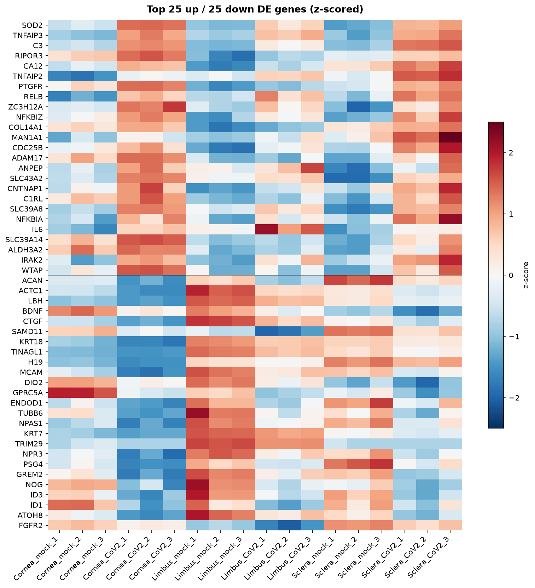

*File: `figures/de_heatmap.png` — Top 25 up-regulated (above the line) and 25 down-regulated genes with padj < 0.05, ranked by padj then |log2FC|; z-scored log2(counts + 1) across 18 samples.*

## 5. Gene Set Enrichment

| Library | Term | Overlap | padj |
|---|---|---|---|
| GO Biological Process 2023 | Inflammatory Response (GO:0006954) | 14/236 | 3.35e-12 |
| GO Biological Process 2023 | Cellular Response To Molecule Of Bacterial Origin (GO:0071219) | 11/117 | 1.17e-11 |
| GO Biological Process 2023 | Cellular Response To Chemokine (GO:1990869) | 9/59 | 2.15e-11 |
| GO Biological Process 2023 | Cellular Response To Lipopolysaccharide (GO:0071222) | 10/124 | 4.48e-10 |
| GO Biological Process 2023 | Chemokine-Mediated Signaling Pathway (GO:0070098) | 8/57 | 6.81e-10 |
| GO Biological Process 2023 | Neutrophil Chemotaxis (GO:0030593) | 8/70 | 3.09e-09 |
| GO Biological Process 2023 | Response To Lipopolysaccharide (GO:0032496) | 10/159 | 3.09e-09 |
| GO Biological Process 2023 | Granulocyte Chemotaxis (GO:0071621) | 8/73 | 3.34e-09 |
| GO Biological Process 2023 | Neutrophil Migration (GO:1990266) | 8/77 | 4.61e-09 |
| GO Biological Process 2023 | Cytokine-Mediated Signaling Pathway (GO:0019221) | 11/257 | 1.29e-08 |
| KEGG 2021 Human | Cytokine-cytokine receptor interaction | 16/295 | 1.45e-14 |
| KEGG 2021 Human | Viral protein interaction with cytokine and cytokine receptor | 11/100 | 2.47e-13 |
| KEGG 2021 Human | Rheumatoid arthritis | 10/93 | 3.95e-12 |
| KEGG 2021 Human | TNF signaling pathway | 10/112 | 1.99e-11 |
| KEGG 2021 Human | IL-17 signaling pathway | 9/94 | 1.27e-10 |
| KEGG 2021 Human | NF-kappa B signaling pathway | 9/104 | 2.67e-10 |
| KEGG 2021 Human | Legionellosis | 7/57 | 3.80e-09 |
| KEGG 2021 Human | Lipid and atherosclerosis | 10/215 | 6.60e-09 |
| KEGG 2021 Human | NOD-like receptor signaling pathway | 9/181 | 2.56e-08 |
| KEGG 2021 Human | Coronavirus disease | 9/232 | 2.01e-07 |

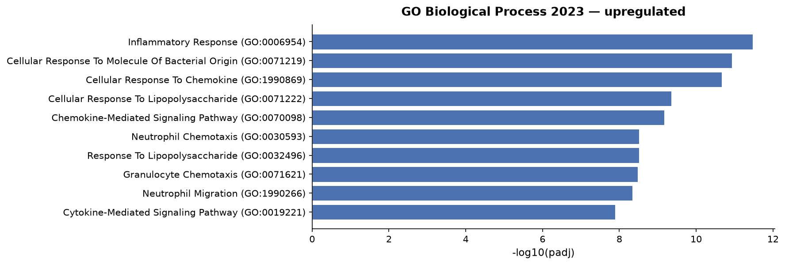

*File: `figures/enrichment_upregulated_go_biological_process_2023.png` — Enrichr GO_Biological_Process_2023, upregulated genes (58 input genes): top 10 terms by adjusted p-value.*

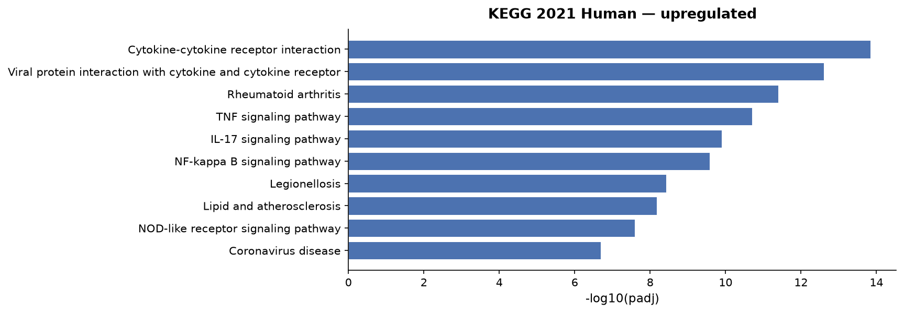

*File: `figures/enrichment_upregulated_kegg_2021_human.png` — Enrichr KEGG_2021_Human, upregulated genes (58 input genes): top 10 terms by adjusted p-value.*

| Library | Term | Overlap | padj |
|---|---|---|---|
| GO Biological Process 2023 | Epithelium Development (GO:0060429) | 11/154 | 1.40e-05 |
| GO Biological Process 2023 | Epithelial Cell Differentiation (GO:0030855) | 9/132 | 2.21e-04 |
| GO Biological Process 2023 | Epidermal Cell Differentiation (GO:0009913) | 6/54 | 6.11e-04 |
| GO Biological Process 2023 | Epidermis Development (GO:0008544) | 7/85 | 6.11e-04 |
| GO Biological Process 2023 | Keratinocyte Differentiation (GO:0030216) | 5/42 | 0.002 |
| GO Biological Process 2023 | Regulation Of Branching Involved In Ureteric Bud Morphogenesis (GO:0090189) | 3/14 | 0.015 |
| GO Biological Process 2023 | Skin Development (GO:0043588) | 5/68 | 0.015 |
| GO Biological Process 2023 | Intermediate Filament Organization (GO:0045109) | 5/68 | 0.015 |
| GO Biological Process 2023 | Positive Regulation Of Kidney Development (GO:0090184) | 2/6 | 0.077 |
| GO Biological Process 2023 | Homophilic Cell Adhesion Via Plasma Membrane Adhesion Molecules (GO:0007156) | 4/60 | 0.084 |
| KEGG 2021 Human | Estrogen signaling pathway | 6/137 | 0.035 |
| KEGG 2021 Human | Staphylococcus aureus infection | 5/95 | 0.035 |
| KEGG 2021 Human | B cell receptor signaling pathway | 4/81 | 0.105 |
| KEGG 2021 Human | Tight junction | 5/169 | 0.215 |
| KEGG 2021 Human | IL-17 signaling pathway | 3/94 | 0.599 |
| KEGG 2021 Human | Tryptophan metabolism | 2/42 | 0.599 |
| KEGG 2021 Human | Glycosphingolipid biosynthesis | 2/45 | 0.599 |
| KEGG 2021 Human | Caffeine metabolism | 1/6 | 0.599 |
| KEGG 2021 Human | Vibrio cholerae infection | 2/50 | 0.613 |
| KEGG 2021 Human | Pathogenic Escherichia coli infection | 4/197 | 0.613 |

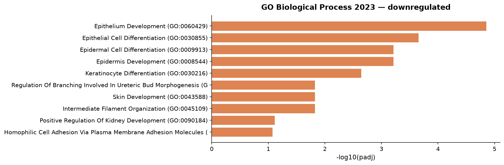

*File: `figures/enrichment_downregulated_go_biological_process_2023.png` — Enrichr GO_Biological_Process_2023, downregulated genes (144 input genes): top 10 terms by adjusted p-value.*

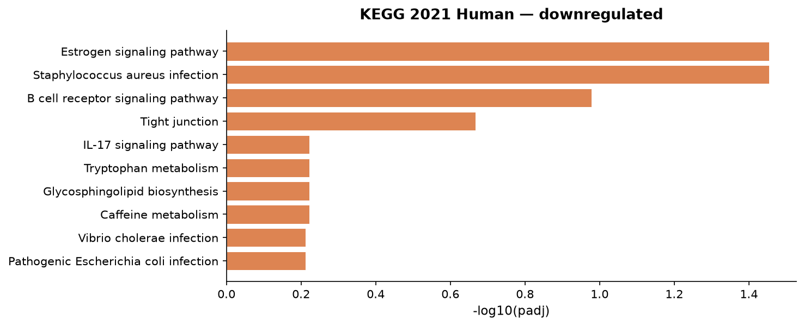

*File: `figures/enrichment_downregulated_kegg_2021_human.png` — Enrichr KEGG_2021_Human, downregulated genes (144 input genes): top 10 terms by adjusted p-value.*

Upregulated genes are dominated by inflammatory and cytokine/chemokine terms such as Inflammatory Response (GO:0006954) (14/236 genes, padj 3.35e-12), Chemokine-Mediated Signaling Pathway (GO:0070098) (8/57 genes, padj 6.81e-10) and NF-kappa B signaling pathway (9/104 genes, padj 2.67e-10), alongside Coronavirus disease (9/232 genes, padj 2.01e-07). Downregulated genes are enriched for Epithelium Development (GO:0060429) (11/154 genes, padj 1.40e-05) and related epithelial/keratinocyte differentiation terms, indicating a loss of epithelial identity programs alongside the inflammatory response.

## 6. Comparison with the Published Study

The associated study ((Eriksen et al., 2021; PMID: 34022129)) reports that SARS-CoV-2-infected ocular surface tissue shows "robust induction of NF-κB in infected cells as well as diminished type I/III interferon signaling." This analysis agrees with the NF-κB/inflammatory induction: RELB (log2FC 1.43, padj 2.73e-39), NFKBIA (log2FC 0.76, padj 2.91e-24) and NFKBIZ (log2FC 0.88, padj 1.58e-32) are all significantly upregulated, and the enrichment results independently recover NF-kappa B signaling pathway (9/104 genes, padj 2.67e-10) among upregulated genes. Regarding interferon signalling, the picture in this contrast is more mixed than "diminished": canonical ISGs such as ISG15 (log2FC 0.01, padj 0.986), IFIT1 (log2FC 0.18, padj 0.133), IFIT3 (log2FC 0.27, padj 0.154), OAS1 (log2FC -0.17, padj 0.626), OAS2 (log2FC 0.14, padj 0.472) and OAS3 (log2FC 0.15, padj 0.302) are not significant in this analysis, while a few others (MX1 (log2FC 0.68, padj 6.03e-06), IRF7 (log2FC 0.29, padj 0.006), STAT1 (log2FC 0.17, padj 5.27e-07)) are significantly, though modestly, upregulated. Type I/III interferon genes themselves (mock, SARS-CoV-2, MOI = 1.0 aside) were not testable — IFNB1, IFNL1, IFNL2 and IFNL3 were filtered out before DE due to low counts, so this dataset cannot directly confirm or refute the reported interferon suppression at the ligand level.

## 7. Biological Interpretation

- The dominant transcriptional signature of SARS-CoV-2 infection across ocular tissues is an innate-immune/inflammatory chemokine response: Cellular Response To Chemokine (GO:1990869) (9/59 genes, padj 2.15e-11) and Cytokine-cytokine receptor interaction (16/295 genes, padj 1.45e-14) are both strongly enriched among upregulated genes, consistent with recruitment of innate immune cells to infected tissue.
- NF-κB pathway activation is evident at the gene level (RELB (log2FC 1.43, padj 2.73e-39), NFKBIA (log2FC 0.76, padj 2.91e-24), TNFAIP3 (log2FC 1.84, padj 2.37e-142) all significantly upregulated) and is independently supported by NF-kappa B signaling pathway (9/104 genes, padj 2.67e-10) enrichment, matching the qualitative direction reported in (Eriksen et al., 2021; PMID: 34022129).
- Classical interferon-stimulated genes (ISG15 (log2FC 0.01, padj 0.986), IFIT1 (log2FC 0.18, padj 0.133), OAS1 (log2FC -0.17, padj 0.626)) are not significantly changed in this contrast, which does not straightforwardly support a strong interferon response either way in the pooled-tissue analysis; this should be interpreted cautiously given the covariate-adjusted, tissue-pooled design rather than tissue-specific comparisons.
- Downregulated genes point to a loss of epithelial/keratinocyte differentiation programs (Epithelium Development (GO:0060429) (11/154 genes, padj 1.40e-05)), a pattern not discussed in the abstract but visible directly in this dataset.
- Because tissue explains the large majority of overall expression variance (99% of PC1), condition-driven effects were only detectable after adjusting for tissue in the model; the infection signature described above is the shared, tissue-adjusted component of the response.

## 8. Limitations

- Each tissue × condition group has a modest number of donor replicates, and PCA shows replicate spread within condition groups is not negligible (3.1 vs 2.8), with a small number of samples (Cornea_mock_1, Cornea_CoV2_2) landing closer to the opposite condition's centroid within their tissue.
- The DESeq2 model pools cornea, limbus and sclera and adjusts for tissue as a covariate; it estimates a shared infection effect across tissues rather than tissue-specific responses, even though the source study highlights the limbus specifically as a site of productive infection.
- Type I/III interferon ligand genes (IFNB1, IFNL1/2/3) were filtered out for low counts before DE and could not be evaluated, limiting direct comparison with the paper's interferon-suppression claim.
- Enrichment analysis used Enrichr's whole-genome background and the default significance/fold-change thresholds (0.05 padj, 1.0 log2FC) rather than a tissue-matched expressed-gene background.
- Data originate from a processed GEO count matrix rather than raw FASTQ reprocessing, so upstream alignment/quantification choices made by the original authors could not be independently verified.

## 9. Methods

### Data

Counts: authors' supplementary file `GSE164073_Eye_count_matrix.csv.gz` from GEO GSE164073 (MD5 `f9a0bc147852a52d6b4397ed214e196b`); values: raw integer counts; gene IDs: symbol; 0 duplicate gene IDs summed.

### Quality control

Library size is the total count per sample and genes detected the number of genes with at least one count, both computed before low-count filtering. PCA: singular value decomposition of gene-centred log2(counts + 1) of the filtered matrix (14,937 genes), without scaling. Sample correlation: Pearson correlation of log2(counts + 1) of the filtered matrix (14,937 genes).

### Low-count filtering

Genes were kept when at least 2 samples had ≥ 10 counts: 14,937 of 27,946 genes kept (46.6% removed).

### Differential expression

Differential expression was tested with PyDESeq2 0.5.4 using the design `~tissue + condition` (covariates tissue treated as categorical), comparing SARS-CoV-2, MOI = 1.0 with mock (reference level). PyDESeq2 fits a negative binomial generalised linear model per gene, with median-of-ratios size factors and dispersions shrunk towards a fitted trend, and tests the condition coefficient with a Wald test. P-values were adjusted with the Benjamini–Hochberg method after PyDESeq2's default independent filtering and Cook's-distance outlier handling; 14,937 genes received an adjusted p-value. Genes with padj < 0.05 are called significant. Log2 fold changes are unshrunken maximum-likelihood estimates.

### Enrichment (up-regulated)

Over-representation analysis of up-regulated genes used Enrichr through GSEApy 1.3.1 against GO_Biological_Process_2023, KEGG_2021_Human (human). Genes with padj < 0.05 and |log2FC| ≥ 1.0 (58 genes) were ranked by padj, then |log2FC|, and the top 58 submitted as 58 gene symbols. Enrichr's default background (all genes in each library) was used, not the genes tested here. Terms are reported by Enrichr's adjusted p-value (Benjamini–Hochberg). Exact input: `analysis/enrichment_input_upregulated.txt`.

### Enrichment (down-regulated)

Over-representation analysis of down-regulated genes used Enrichr through GSEApy 1.3.1 against GO_Biological_Process_2023, KEGG_2021_Human (human). Genes with padj < 0.05 and |log2FC| ≥ 1.0 (144 genes) were ranked by padj, then |log2FC|, and the top 144 submitted as 144 gene symbols. Enrichr's default background (all genes in each library) was used, not the genes tested here. Terms are reported by Enrichr's adjusted p-value (Benjamini–Hochberg). Exact input: `analysis/enrichment_input_downregulated.txt`.

### Software

| Software | Version |
|---|---|
| Python | 3.11.14 |
| NumPy | 2.4.6 |
| pandas | 2.3.3 |
| PyDESeq2 | 0.5.4 |
| Matplotlib | 3.11.2 |
| SciPy | 1.17.1 |
| GSEApy | 1.3.1 |

### Reproducibility

Every analysis step is logged in `analysis/tool_calls.jsonl`, and `analysis/replay.py` re-runs them without the LLM. This Methods section is generated from those steps, not written by the LLM.

## 10. References

- (Eriksen et al., 2021; PMID: 34022129)

---

**Disclaimer:** This report was generated by an AI system. Large language models can produce inaccurate statements (hallucinations). All biological claims, gene annotations, pathway interpretations, and cited references should be independently verified before use in publications or clinical decisions. Biological roles listed alongside gene names are AI-generated summaries and must be verified against primary databases (UniProt, NCBI Gene).
