# GFI1B ectopic expression in iPSC-derived hemogenic endothelium (GSE246386)

## 1. Executive Summary
This analysis compared GFI1B-overexpressing CD34+ iPSC-derived hemogenic endothelium with empty-vector (EV) controls using Salmon gene-level counts. 4,417 of 15,159 tested genes were significant (29.1%). The hematopoietic regulators named in the associated study ((Zhang et al., 2024; PMID: 38961746)) rose, and endothelial and extracellular-matrix programmes fell. Upregulated genes were also enriched for cell-cycle and interferon-response terms.

## 2. Experimental Design
The dataset is GSE246386: human (GRCh38) CD34+CD43-CD73- iPSC-derived hemogenic endothelium, sampled at the day-four stage according to the GEO sample titles. The design has 6 samples, with conditions EV, GFI1B (3 EV and 3 GFI1B replicates). The contrast is GFI1B vs EV, with EV as the reference. The design file has no other varying factor, so no covariates were used. The counts come from nf-core/rnaseq (Salmon pseudo-alignment (alignment skipped)).

## 3. Quality Control

| Sample | Condition | Total counts | Genes detected |
|---|---|---|---|
| EV_1 | EV | 14,412,609 | 18,566 |
| EV_2 | EV | 13,197,338 | 17,484 |
| EV_3 | EV | 12,182,583 | 17,252 |
| GFI1B_1 | GFI1B | 12,028,624 | 18,360 |
| GFI1B_2 | GFI1B | 13,379,353 | 18,914 |
| GFI1B_3 | GFI1B | 16,047,135 | 19,240 |

*Genes detected: genes with at least one count, before low-count filtering.*

Library sizes ranged from 12.0 to 16.0 million (median 13.3 million). Between 17,252 and 19,240 genes were detected per sample. Salmon mapping rates were 85.02–86.16%. Raw FastQC duplication was 57.10–71.30%.

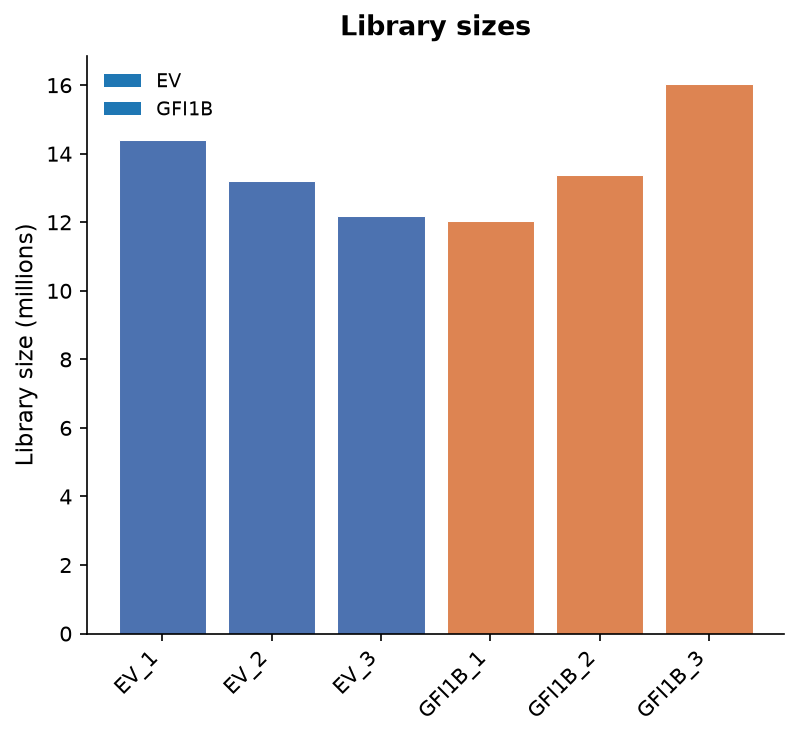

*File: `figures/library_sizes.png` — Total counts per sample before low-count filtering (6 samples, 12.0–16.0 million), coloured by condition.*

On PC1–PC2, mean distance of replicates to their group centroid: EV 41.6, GFI1B 4.9; group centroids are 118.2 apart. The most spread group is 8.4× the least spread. Condition explains 98% of PC1 and 0% of PC2 variance. Samples closer to another group's centroid: none. PC1 explains 60.7% of variance and PC2 15.7%. The EV replicates are much more dispersed than the GFI1B replicates (spread 41.6 vs 4.9). No sample clusters with the other group.

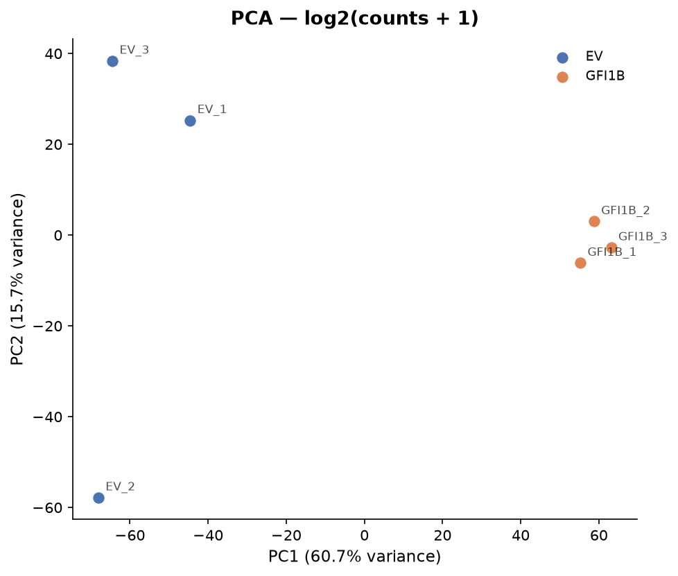

*File: `figures/pca.png` — PCA of log2(counts + 1): PC1 60.7%, PC2 15.7% of variance, coloured by condition. On PC1–PC2, mean distance of replicates to their group centroid: EV 41.6, GFI1B 4.9; group centroids are 118.2 apart. The most spread group is 8.4× the least spread. Condition explains 98% of PC1 and 0% of PC2 variance. Samples closer to another group's centroid: none.*

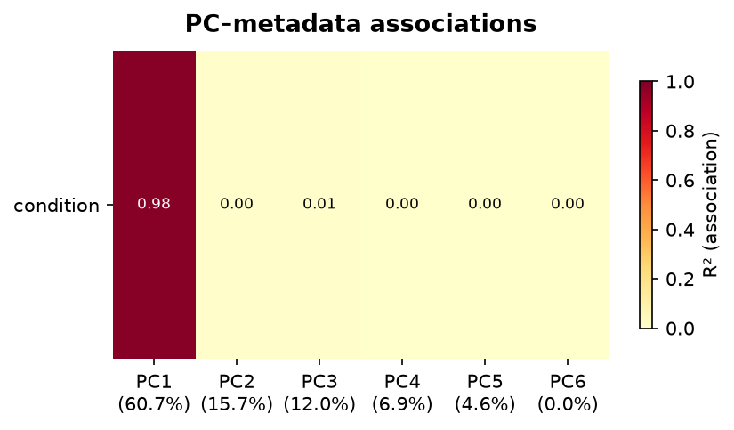

*File: `figures/pc_association.png` — Association (R²) between the first 6 principal components and design variables: condition.*

Pairwise sample correlations ranged from 0.90 to 0.98.

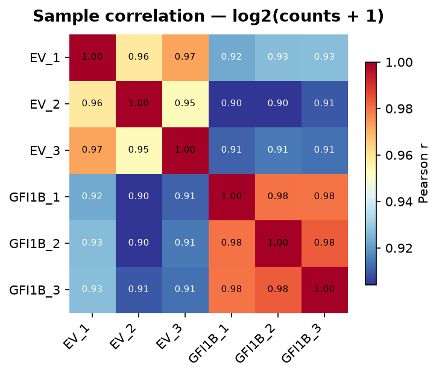

*File: `figures/sample_correlation.png` — Pearson correlation of log2(counts + 1) between all 6 samples (range 0.90–0.98 between different samples).*

No sample was flagged as an outlier by the PCA facts. The EV group's uneven spread is noted under Limitations.

## 4. Differential Expression

| Measure | Value |
|---|---|
| Contrast | GFI1B vs EV |
| Design | `~condition` |
| Genes tested | 15,159 |
| Significant (padj < 0.05) | 4,417 (29.1%) |
| Up-regulated | 2,308 (15.2%) |
| Down-regulated | 2,109 (13.9%) |

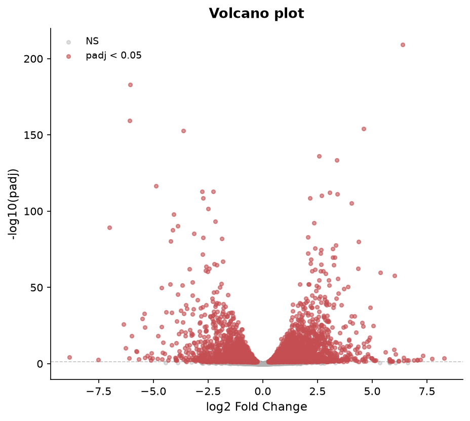

*File: `figures/volcano.png` — Volcano plot: 15159 genes tested; 4417 with padj < 0.05 (2308 up, 2109 down; design ~condition).*

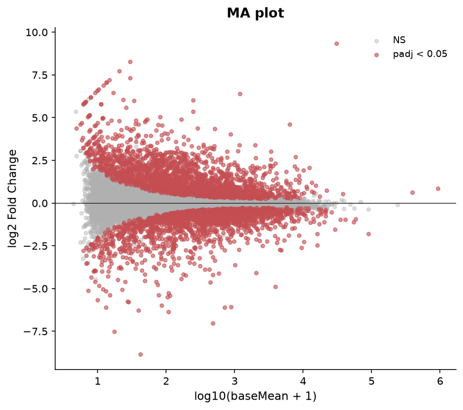

*File: `figures/ma_plot.png` — MA plot: 15159 genes tested; 4417 with padj < 0.05 (2308 up, 2109 down; design ~condition).*

Top upregulated genes:

| Gene | log2FC | padj | baseMean |
|---|---|---|---|
| GFI1B | 9.35 | < 1e-300 | 30413 |
| ALOX15 | 6.39 | 5.45e-210 | 1198 |
| IGFBP5 | 4.61 | 6.69e-155 | 6373 |
| CCDC80 | 2.56 | 6.20e-137 | 3382 |
| TGFBI | 3.39 | 4.06e-134 | 1993 |
| MYBL2 | 3.06 | 6.93e-113 | 1116 |
| ATP2A3 | 3.40 | 4.48e-112 | 1173 |
| MX1 | 2.69 | 4.14e-111 | 7764 |
| APLNR | 2.16 | 2.38e-109 | 7527 |
| NTS | 4.05 | 5.91e-106 | 864 |

Top downregulated genes:

| Gene | log2FC | padj | baseMean |
|---|---|---|---|
| GIMAP4 | -6.06 | 8.96e-184 | 880 |
| WLS | -6.09 | 5.59e-160 | 715 |
| LGMN | -3.63 | 1.64e-153 | 1010 |
| COL5A2 | -4.87 | 3.72e-117 | 3926 |
| PRCP | -2.76 | 1.13e-113 | 4827 |
| GJA5 | -2.25 | 1.51e-113 | 10220 |
| COLEC12 | -2.74 | 1.94e-109 | 4538 |
| ANXA6 | -2.49 | 1.88e-102 | 2560 |
| RAMP2 | -4.08 | 1.61e-98 | 2058 |
| EFEMP1 | -2.17 | 6.25e-94 | 5279 |

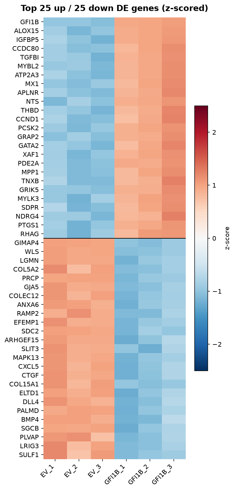

*File: `figures/de_heatmap.png` — Top 25 up-regulated (above the line) and 25 down-regulated genes with padj < 0.05, ranked by padj then |log2FC|; z-scored log2(counts + 1) across 6 samples.*

GFI1B (log2FC 9.35, padj < 1e-300) is the most strongly induced gene, as expected for ectopic expression. ALOX15 (log2FC 6.39, padj 5.45e-210) is also strongly up.

## 5. Gene Set Enrichment
Upregulated genes:

| Library | Term | Overlap | padj |
|---|---|---|---|
| GO Biological Process 2023 | DNA Unwinding Involved In DNA Replication (GO:0006268) | 12/20 | 1.41e-11 |
| GO Biological Process 2023 | Defense Response To Virus (GO:0051607) | 27/189 | 2.73e-10 |
| GO Biological Process 2023 | Defense Response To Symbiont (GO:0140546) | 24/148 | 2.73e-10 |
| GO Biological Process 2023 | DNA Duplex Unwinding (GO:0032508) | 14/41 | 3.80e-10 |
| GO Biological Process 2023 | Mitotic Sister Chromatid Segregation (GO:0000070) | 20/111 | 2.10e-09 |
| GO Biological Process 2023 | DNA-templated DNA Replication (GO:0006261) | 16/69 | 4.04e-09 |
| GO Biological Process 2023 | Microtubule Cytoskeleton Organization Involved In Mitosis (GO:1902850) | 15/59 | 4.04e-09 |
| GO Biological Process 2023 | Positive Regulation Of Cell Cycle Process (GO:0090068) | 20/118 | 4.25e-09 |
| GO Biological Process 2023 | Double-Strand Break Repair Via Break-Induced Replication (GO:0000727) | 8/11 | 6.38e-09 |
| GO Biological Process 2023 | Mitotic Spindle Organization (GO:0007052) | 16/85 | 7.60e-08 |
| KEGG 2021 Human | Cell cycle | 24/124 | 1.30e-12 |
| KEGG 2021 Human | DNA replication | 8/36 | 2.91e-04 |
| KEGG 2021 Human | Platelet activation | 12/124 | 0.005 |
| KEGG 2021 Human | Epstein-Barr virus infection | 15/202 | 0.009 |
| KEGG 2021 Human | B cell receptor signaling pathway | 9/81 | 0.009 |
| KEGG 2021 Human | ECM-receptor interaction | 9/88 | 0.014 |
| KEGG 2021 Human | Influenza A | 13/172 | 0.014 |
| KEGG 2021 Human | p53 signaling pathway | 8/73 | 0.014 |
| KEGG 2021 Human | Cellular senescence | 12/156 | 0.015 |
| KEGG 2021 Human | Hepatitis C | 12/157 | 0.015 |

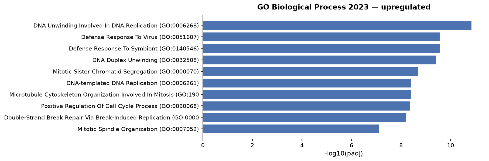

*File: `figures/enrichment_upregulated_go_biological_process_2023.png` — Enrichr GO_Biological_Process_2023, upregulated genes (500 input genes): top 10 terms by adjusted p-value.*

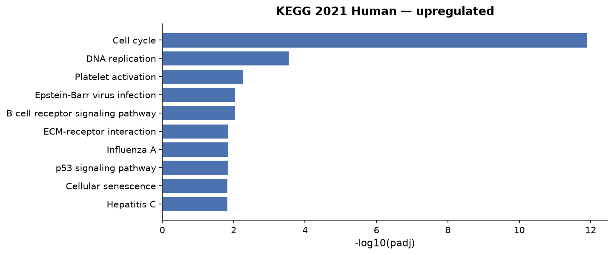

*File: `figures/enrichment_upregulated_kegg_2021_human.png` — Enrichr KEGG_2021_Human, upregulated genes (500 input genes): top 10 terms by adjusted p-value.*

Downregulated genes:

| Library | Term | Overlap | padj |
|---|---|---|---|
| GO Biological Process 2023 | Aortic Valve Morphogenesis (GO:0003180) | 10/37 | 4.12e-05 |
| GO Biological Process 2023 | Aortic Valve Development (GO:0003176) | 10/40 | 4.68e-05 |
| GO Biological Process 2023 | Regulation Of Pathway-Restricted SMAD Protein Phosphorylation (GO:0060393) | 11/61 | 2.39e-04 |
| GO Biological Process 2023 | Extracellular Matrix Organization (GO:0030198) | 18/176 | 2.91e-04 |
| GO Biological Process 2023 | Collagen Fibril Organization (GO:0030199) | 9/42 | 3.78e-04 |
| GO Biological Process 2023 | Cell Surface Receptor Signaling Pathway Involved In Heart Development (GO:0061311) | 6/16 | 6.35e-04 |
| GO Biological Process 2023 | Endothelial Cell Proliferation (GO:0001935) | 6/18 | 0.001 |
| GO Biological Process 2023 | Pulmonary Valve Morphogenesis (GO:0003184) | 6/18 | 0.001 |
| GO Biological Process 2023 | Cardiac Ventricle Development (GO:0003231) | 6/19 | 0.001 |
| GO Biological Process 2023 | Sprouting Angiogenesis (GO:0002040) | 9/52 | 0.001 |
| KEGG 2021 Human | Cell adhesion molecules | 16/148 | 2.47e-04 |
| KEGG 2021 Human | PPAR signaling pathway | 9/74 | 0.012 |
| KEGG 2021 Human | Protein digestion and absorption | 10/103 | 0.022 |
| KEGG 2021 Human | Arrhythmogenic right ventricular cardiomyopathy | 8/77 | 0.033 |
| KEGG 2021 Human | Fluid shear stress and atherosclerosis | 11/139 | 0.033 |
| KEGG 2021 Human | Inflammatory mediator regulation of TRP channels | 9/98 | 0.033 |
| KEGG 2021 Human | AGE-RAGE signaling pathway in diabetic complications | 9/100 | 0.033 |
| KEGG 2021 Human | TNF signaling pathway | 9/112 | 0.052 |
| KEGG 2021 Human | Th1 and Th2 cell differentiation | 8/92 | 0.052 |
| KEGG 2021 Human | Axon guidance | 12/182 | 0.052 |

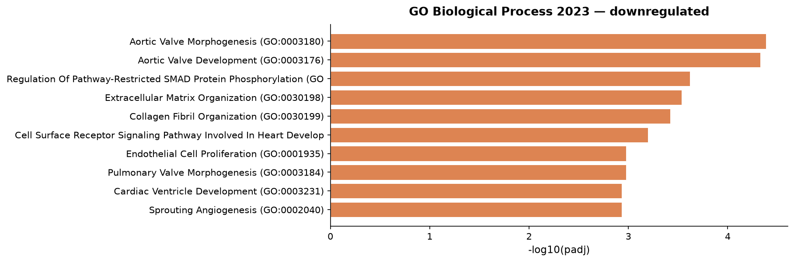

*File: `figures/enrichment_downregulated_go_biological_process_2023.png` — Enrichr GO_Biological_Process_2023, downregulated genes (500 input genes): top 10 terms by adjusted p-value.*

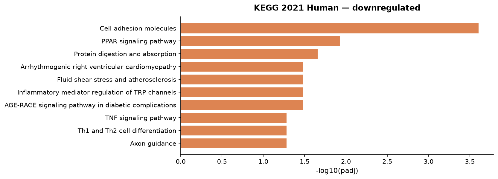

*File: `figures/enrichment_downregulated_kegg_2021_human.png` — Enrichr KEGG_2021_Human, downregulated genes (500 input genes): top 10 terms by adjusted p-value.*

## 6. Comparison with the published study

| Gene | Named in (PMID) | log2FC | padj | This analysis |
|---|---|---|---|---|
| GFI1B | 38961746 | 9.35 | < 1e-300 | up |
| KDM1A | 38961746 | 0.16 | 0.333 | not significant |
| GATA2 | 38961746 | 2.38 | 1.93e-76 | up |
| KIT | 38961746 | 1.75 | 2.68e-07 | up |
| RUNX1 | 38961746 | 2.39 | 1.74e-62 | up |
| SPI1 | 38961746 | 1.61 | 5.32e-04 | up |

*Genes named in the fetched abstract(s), with this analysis's result (GFI1B vs EV).*

The abstract ((Zhang et al., 2024; PMID: 38961746)) reports that ectopic GFI1B expression downregulated endothelial genes and upregulated hematopoietic genes, including GATA2, KIT, RUNX1 and SPI1. In this analysis GATA2 (log2FC 2.38, padj 1.93e-76), KIT (log2FC 1.75, padj 2.68e-07), RUNX1 (log2FC 2.39, padj 1.74e-62) and SPI1 (log2FC 1.61, padj 5.32e-04) are all significantly up, which agrees with the abstract. KDM1A (log2FC 0.16, padj 0.333) is not significantly changed. The abstract describes the hematopoietic specification as "partial". Endothelial markers CDH5 (log2FC -0.38, padj 6.86e-04) and PECAM1 (log2FC -0.55, padj 2.16e-06) fall only modestly, and KDR (log2FC -0.30, padj 0.196) is not significant.

## 7. Biological Interpretation
- The hematopoietic regulators GATA2 (log2FC 2.38, padj 1.93e-76), RUNX1 (log2FC 2.39, padj 1.74e-62) and KIT (log2FC 1.75, padj 2.68e-07) are induced, consistent with (Zhang et al., 2024; PMID: 38961746).
- Downregulated genes are enriched for Sprouting Angiogenesis (GO:0002040) (9/52 genes, padj 0.001) and Endothelial Cell Proliferation (GO:0001935) (6/18 genes, padj 0.001). They are also enriched for Extracellular Matrix Organization (GO:0030198) (18/176 genes, padj 2.91e-04). The endothelial genes DLL4 (log2FC -1.82, padj 1.13e-67), HEY1 (log2FC -1.61, padj 4.65e-32) and TEK (log2FC -1.03, padj 1.17e-09) are all lower. This fits reduced endothelial identity.
- Upregulated genes show strong enrichment for Cell cycle (24/124 genes, padj 1.30e-12) and DNA replication (8/36 genes, padj 2.91e-04). The replication-licensing family is also shifted: MCM* genes: 9 of 12 significant (8 up, 1 down). GFI1B overexpression therefore coincides with a proliferative signature.
- An interferon-response signature is also enriched: Defense Response To Virus (GO:0051607) (27/189 genes, padj 2.73e-10). IFIT1 (log2FC 1.76, padj 1.63e-17) is up. This design does not show whether the signature reflects GFI1B, the vector or transduction.
- Collagen genes do not move uniformly: COL* genes: 26 of 40 significant (12 up, 14 down). For example COL5A2 (log2FC -4.87, padj 3.72e-117) is down while COL1A1 (log2FC 2.18, padj 1.58e-38) is up, so the ECM signal is not a simple global decrease.

## 8. Limitations
- There are only three replicates per group. EV replicates are much more dispersed in PCA than GFI1B replicates, which may affect variance estimates.
- Only a single stage is sampled. The analysis does not separate direct GFI1B targets from secondary effects.
- Enrichment used the top-ranked genes per direction, capped at the maximum given in Methods. More genes passed the thresholds than were tested, so lower-ranked genes were not included. The enrichment background is the Enrichr default.
- Salmon counts are fractional and were rounded before DE. Alignment was skipped, so there are no alignment-based QC metrics.
- The data come from a public GEO series, and no details of the expression vector beyond the GEO metadata are recorded here.

## 9. Methods

### Data and quantification

Reads were processed with nf-core/rnaseq v3.26.0-ge7ca462 (Nextflow 26.04.6). Quantification: Salmon pseudo-alignment (alignment skipped) (Salmon 1.10.3); the pipeline summarised transcript estimates to gene-level counts with tximeta 1.20.1, in `salmon.merged.gene_counts.tsv`. Gene annotation: iGenomes Homo sapiens NCBI GRCh38 (`s3://ngi-igenomes/igenomes//Homo_sapiens/NCBI/GRCh38/Annotation/Genes/genes.gtf`), reused from the shared reference cache.

### Quality control

Library size is the total count per sample and genes detected the number of genes with at least one count, both computed before low-count filtering. PCA: singular value decomposition of gene-centred log2(counts + 1) of the filtered matrix (15,161 genes), without scaling. Sample correlation: Pearson correlation of log2(counts + 1) of the filtered matrix (15,161 genes). Read-level metrics come from the pipeline's MultiQC general statistics.

### Low-count filtering

Genes were kept when at least 2 samples had ≥ 10 counts: 15,161 of 29,607 genes kept (48.8% removed).

### Differential expression

Non-integer estimated counts (70.9% of values) were rounded to integers. Differential expression was tested with PyDESeq2 0.5.4 using the design `~condition`, comparing GFI1B with EV (reference level). PyDESeq2 fits a negative binomial generalised linear model per gene, with median-of-ratios size factors and dispersions shrunk towards a fitted trend, and tests the condition coefficient with a Wald test. P-values were adjusted with the Benjamini–Hochberg method after PyDESeq2's default independent filtering and Cook's-distance outlier handling; 15,159 genes received an adjusted p-value. Genes with padj < 0.05 are called significant. Log2 fold changes are unshrunken maximum-likelihood estimates.

### Enrichment (up-regulated)

Over-representation analysis of up-regulated genes used Enrichr through GSEApy 1.3.1 against GO_Biological_Process_2023, KEGG_2021_Human (human). Genes with padj < 0.05 and |log2FC| ≥ 1.0 (1,313 genes) were ranked by padj, then |log2FC|, and the top 500 submitted as 500 gene symbols. Enrichr's default background (all genes in each library) was used, not the genes tested here. Terms are reported by Enrichr's adjusted p-value (Benjamini–Hochberg). Exact input: `analysis/enrichment_input_upregulated.txt`.

### Enrichment (down-regulated)

Over-representation analysis of down-regulated genes used Enrichr through GSEApy 1.3.1 against GO_Biological_Process_2023, KEGG_2021_Human (human). Genes with padj < 0.05 and |log2FC| ≥ 1.0 (828 genes) were ranked by padj, then |log2FC|, and the top 500 submitted as 500 gene symbols. Enrichr's default background (all genes in each library) was used, not the genes tested here. Terms are reported by Enrichr's adjusted p-value (Benjamini–Hochberg). Exact input: `analysis/enrichment_input_downregulated.txt`.

### Software

| Software | Version |
|---|---|
| Python | 3.11.14 |
| NumPy | 2.4.6 |
| pandas | 2.3.3 |
| PyDESeq2 | 0.5.4 |
| Matplotlib | 3.11.2 |
| SciPy | 1.17.1 |
| GSEApy | 1.3.1 |
| nf-core: nf-core/rnaseq | v3.26.0-ge7ca462 |
| nf-core: Nextflow | 26.04.6 |
| nf-core: Salmon | 1.10.3 |
| nf-core: tximeta | 1.20.1 |

### Reproducibility

Every analysis step is logged in `analysis/tool_calls.jsonl`, and `analysis/replay.py` re-runs them without the LLM. This Methods section is generated from those steps, not written by the LLM.

## 10. References
(Zhang et al., 2024; PMID: 38961746)

---

**Disclaimer:** This report was generated by an AI system. Large language models can produce inaccurate statements (hallucinations). All biological claims, gene annotations, pathway interpretations, and cited references should be independently verified before use in publications or clinical decisions. Biological roles listed alongside gene names are AI-generated summaries and must be verified against primary databases (UniProt, NCBI Gene).
